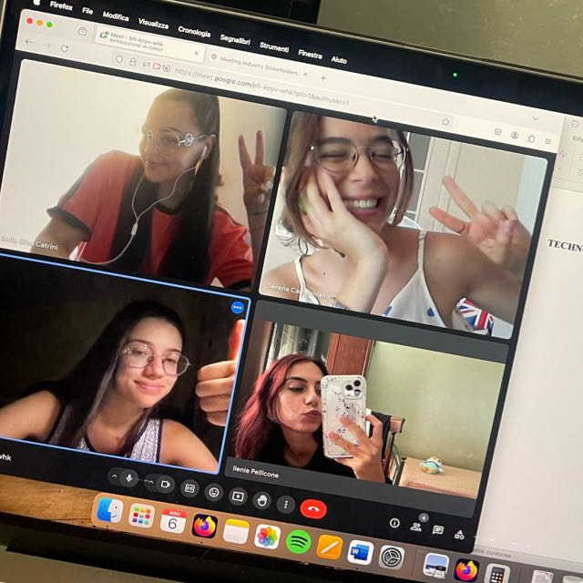

## Team Members

- **Palma Mango**
- **Serena Campaniello**
- **Ilenia Pellicone**
- **Sofia Elisa Catrini**

## Our Collaboration

This project was developed as part of the Master's degree course in Language, Society, and Communication at the University of Bologna. Despite the geographical distances separating our team members, we were able to collaborate effectively through the use of online tools, particularly Google Meet. Each session allowed us to work together in real-time, discussing ideas, solving problems, and refining our approach to enriching the ArCo Knowledge Graph.

