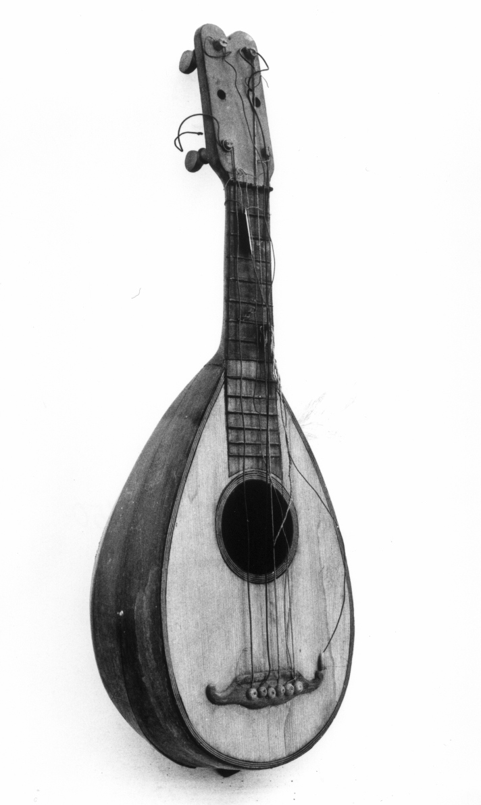

In our project, we aimed to enrich the [ArCo Knowledge Graph](http://wit.istc.cnr.it/arco/?lang=en) by identifying and connecting underrepresented or missing cultural elements related to Italian musical heritage, particularly focusing on traditional instruments and their cultural contexts. Below, we outline the step-by-step process that we followed, from querying existing data to creating new RDF triples.

## Step 1: Querying the ArCo Knowledge Graph

### 1.1 Listing Elements of the arco:MusicHeritage Class

We began by exploring the `arco:MusicHeritage` class to list its elements. The goal was to identify all entities classified under this class, with a particular focus on musical instruments. We limited the results to the first 50 entries, ordered alphabetically by their labels.

#### Query 1

```sparql
PREFIX arco: <https://w3id.org/arco/ontology/arco/>
SELECT DISTINCT ?instrument ?label
WHERE {
  ?instrument rdf:type arco:MusicHeritage ;
              rdfs:label ?label .
}
ORDER BY (?label)
LIMIT 50
```

The results of this query are visitable at the following URL: [MusicHeritage Query Results](https://dati.cultura.gov.it/sparql?default-graph-uri=&query=PREFIX+arco%3A+%3Chttps%3A%2F%2Fw3id.org%2Farco%2Fontology%2Farco%2F%3E%0D%0ASELECT+DISTINCT+%3Finstrument+%3Flabel%0D%0AWHERE+%7B%0D%0A++%3Finstrument+rdf%3Atype+arco%3AMusicHeritage+%3B%0D%0A++++++++++%09rdfs%3Alabel+%3Flabel+.%0D%0A++++++++%09+%0D%0A%7D%0D%0AORDER+BY+%28%3Flabel%29%0D%0ALIMIT+50%0D%0A&format=text%2Fhtml&timeout=0&signal_void=on).

### 1.2 Searching for Specific Musical Instruments

Next, we focused on finding specific musical instruments by searching for entities containing the terms *"mandolino"*, *"tamburello"* or *"zampogna"* in their labels. This query used the `UNION` clause to combine results for these three instruments and was also limited to 50 results.

#### Query 2

```sparql
PREFIX arco: <https://w3id.org/arco/ontology/arco/>

SELECT DISTINCT ?instrument ?label
WHERE {
  {
    ?instrument rdf:type arco:MusicHeritage ;
                rdfs:label ?label .
    FILTER(REGEX(?label, "mandolino", "i"))
  }
  UNION
  {
    ?instrument rdf:type arco:MusicHeritage ;
                rdfs:label ?label .
    FILTER(REGEX(?label, "tamburello", "i"))
  }
  UNION
  {
    ?instrument rdf:type arco:MusicHeritage ;
                rdfs:label ?label .
    FILTER(REGEX(?label, "zampogna", "i"))
  }
}
ORDER BY (?label)
LIMIT 50
```

The results of this query are visitable at the following URL: [Specific Musical Instruments Query Results](https://dati.cultura.gov.it/sparql?default-graph-uri=&query=PREFIX+arco%3A+%3Chttps%3A%2F%2Fw3id.org%2Farco%2Fontology%2Farco%2F%3E%0D%0A%0D%0ASELECT+DISTINCT+%3Finstrument+%3Flabel%0D%0AWHERE+%7B%0D%0A++%7B%0D%0A%09%3Finstrument+rdf%3Atype+arco%3AMusicHeritage+%3B%0D%0A++++++++++++%09rdfs%3Alabel+%3Flabel+.%0D%0A%09FILTER%28REGEX%28%3Flabel%2C+%22mandolino%22%2C+%22i%22%29%29%0D%0A++%7D%0D%0A++UNION%0D%0A++%7B%0D%0A%09%3Finstrument+rdf%3Atype+arco%3AMusicHeritage+%3B%0D%0A++++++++++++%09rdfs%3Alabel+%3Flabel+.%0D%0A%09FILTER%28REGEX%28%3Flabel%2C+%22tamburello%22%2C+%22i%22%29%29%0D%0A++%7D%0D%0A++UNION%0D%0A++%7B%0D%0A%09%3Finstrument+rdf%3Atype+arco%3AMusicHeritage+%3B%0D%0A++++++++++++%09rdfs%3Alabel+%3Flabel+.%0D%0A%09FILTER%28REGEX%28%3Flabel%2C+%22zampogna%22%2C+%22i%22%29%29%0D%0A++%7D%0D%0A%7D%0D%0AORDER+BY+%28%3Flabel%29%0D%0ALIMIT+50%0D%0A%0D%0A&format=text%2Fhtml&timeout=0&signal_void=on).


### 1.3 Isolating "Mandolino" Results
Upon reviewing the results of [Query 2](#query-2), we noticed that there were no relevant entries for *'mandolino'*. To ensure accuracy, we decided to refine the query by isolating only the term *'mandolino'* and executing it again.


#### Query 3

```sparql
PREFIX arco: <https://w3id.org/arco/ontology/arco/>

SELECT DISTINCT ?instrument ?label
WHERE {
  ?instrument rdf:type arco:MusicHeritage ;
              rdfs:label ?label .
  FILTER(REGEX(?label, "mandolino", "i"))
}
```

The results of this query are visitable at the following URL: [Mandolino Query Results](https://dati.cultura.gov.it/sparql?default-graph-uri=&query=PREFIX+arco%3A+%3Chttps%3A%2F%2Fw3id.org%2Farco%2Fontology%2Farco%2F%3E%0D%0A%0D%0ASELECT+DISTINCT+%3Finstrument+%3Flabel%0D%0AWHERE+%7B%0D%0A%0D%0A%09%3Finstrument+rdf%3Atype+arco%3AMusicHeritage+%3B%0D%0A++++++++++++%09rdfs%3Alabel+%3Flabel+.%0D%0A%09FILTER%28REGEX%28%3Flabel%2C+%22mandolino%22%2C+%22i%22%29%29%0D%0A+%0D%0A+%7D%0D%0A&format=text%2Fhtml&timeout=0&signal_void=on).


### 1.4 Expanding the Search to arco:MovableCulturalProperty

Finding no results under the `arco:MusicHeritage` class, as shown in [Query 3](#query-3), we expanded our search to include the parent class, `arco:MovableCulturalProperty`. This query successfully identified several instances of *'mandolino'* under this broader category, although some of these instances did not specifically refer to a musical instrument.


#### Query 4

```sparql
PREFIX arco: <https://w3id.org/arco/ontology/arco/>

SELECT DISTINCT ?instrument ?label
WHERE {
  ?instrument rdf:type arco:MovableCulturalProperty ;
              rdfs:label ?label .
  FILTER(REGEX(?label, "mandolino", "i"))
}
```

The results of this query are visitable at the following URL: [MovableCulturalProperty Query Results](https://dati.cultura.gov.it/sparql?default-graph-uri=&query=PREFIX+arco%3A+%3Chttps%3A%2F%2Fw3id.org%2Farco%2Fontology%2Farco%2F%3E%0D%0A%0D%0ASELECT+DISTINCT+%3Finstrument+%3Flabel%0D%0AWHERE+%7B%0D%0A++%3Finstrument+rdf%3Atype+arco%3AMovableCulturalProperty+%3B%0D%0A++++++++++++++rdfs%3Alabel+%3Flabel+.%0D%0A++FILTER%28REGEX%28%3Flabel%2C+%22mandolino%22%2C+%22i%22%29%29%0D%0A%7D&format=text%2Fhtml&timeout=0&signal_void=on).


One such result, for example, was:

- [Mandolino: Chiocca Filippo](https://dati.beniculturali.it/lodview-arco/resource/HistoricOrArtisticProperty/1200066104.html)





## Creating RDF Triples to Enrich the ArCo KG

### 2.1 Assigning the Correct Class

Upon identifying an entity representing the mandolin by Chiocca Filippo (as well as the other mandolins), we noted that it lacked a connection to the arco:MusicHeritage class. To address this, we created new RDF triples to establish this link:

#### Triple 1

```rdf
<https://w3id.org/arco/resource/HistoricOrArtisticProperty/1200066112>
    
    rdf:type

<https://w3id.org/arco/ontology/arco/MusicHeritage> 
```

#### Triple 2

```rdf
[<https://w3id.org/arco/resource/HistoricOrArtisticProperty/1200066113>](https://w3id.org/arco/resource/HistoricOrArtisticProperty/1200066113)
    
    rdf:type
    
<https://w3id.org/arco/ontology/arco/MusicHeritage>

```

