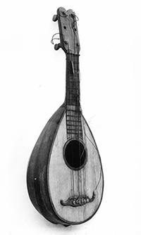

In our project, we aimed to enrich the [ArCo Knowledge Graph](http://wit.istc.cnr.it/arco/?lang=en) by identifying and connecting underrepresented or missing cultural elements related to Italian musical heritage, particularly focusing on traditional instruments and their cultural contexts. Below, we outline the step-by-step process that we followed, from querying existing data to creating new RDF triples.

## Step 1: Querying the ArCo Knowledge Graph

### 1.1 Listing Elements of the arco:MusicHeritage Class

We began by exploring the `arco:MusicHeritage` class to list its elements. The goal was to identify all entities classified under this class, with a particular focus on musical instruments. We limited the results to the first 50 entries, ordered alphabetically by their labels.

#### Query 1

```sparql
PREFIX arco: <https://w3id.org/arco/ontology/arco/>
SELECT DISTINCT ?instrument ?label
WHERE {
  ?instrument rdf:type arco:MusicHeritage ;
              rdfs:label ?label .
}
ORDER BY (?label)
LIMIT 50
```

The results of this query are visitable at the following URL: [MusicHeritage Query Results](https://dati.cultura.gov.it/sparql?default-graph-uri=&query=PREFIX+arco%3A+%3Chttps%3A%2F%2Fw3id.org%2Farco%2Fontology%2Farco%2F%3E%0D%0ASELECT+DISTINCT+%3Finstrument+%3Flabel%0D%0AWHERE+%7B%0D%0A++%3Finstrument+rdf%3Atype+arco%3AMusicHeritage+%3B%0D%0A++++++++++%09rdfs%3Alabel+%3Flabel+.%0D%0A++++++++%09+%0D%0A%7D%0D%0AORDER+BY+%28%3Flabel%29%0D%0ALIMIT+50%0D%0A&format=text%2Fhtml&timeout=0&signal_void=on).

### 1.2 Searching for Specific Musical Instruments

Next, we focused on finding specific musical instruments by searching for entities containing the terms *"mandolino"*, *"tamburello"* or *"zampogna"* in their labels. This query used the `UNION` clause to combine results for these three instruments and was also limited to 50 results.

#### Query 2

```sparql
PREFIX arco: <https://w3id.org/arco/ontology/arco/>

SELECT DISTINCT ?instrument ?label
WHERE {
  {
    ?instrument rdf:type arco:MusicHeritage ;
                rdfs:label ?label .
    FILTER(REGEX(?label, "mandolino", "i"))
  }
  UNION
  {
    ?instrument rdf:type arco:MusicHeritage ;
                rdfs:label ?label .
    FILTER(REGEX(?label, "tamburello", "i"))
  }
  UNION
  {
    ?instrument rdf:type arco:MusicHeritage ;
                rdfs:label ?label .
    FILTER(REGEX(?label, "zampogna", "i"))
  }
}
ORDER BY (?label)
LIMIT 50
```

The results of this query are visitable at the following URL: [Specific Musical Instruments Query Results](https://dati.cultura.gov.it/sparql?default-graph-uri=&query=PREFIX+arco%3A+%3Chttps%3A%2F%2Fw3id.org%2Farco%2Fontology%2Farco%2F%3E%0D%0A%0D%0ASELECT+DISTINCT+%3Finstrument+%3Flabel%0D%0AWHERE+%7B%0D%0A++%7B%0D%0A%09%3Finstrument+rdf%3Atype+arco%3AMusicHeritage+%3B%0D%0A++++++++++++%09rdfs%3Alabel+%3Flabel+.%0D%0A%09FILTER%28REGEX%28%3Flabel%2C+%22mandolino%22%2C+%22i%22%29%29%0D%0A++%7D%0D%0A++UNION%0D%0A++%7B%0D%0A%09%3Finstrument+rdf%3Atype+arco%3AMusicHeritage+%3B%0D%0A++++++++++++%09rdfs%3Alabel+%3Flabel+.%0D%0A%09FILTER%28REGEX%28%3Flabel%2C+%22tamburello%22%2C+%22i%22%29%29%0D%0A++%7D%0D%0A++UNION%0D%0A++%7B%0D%0A%09%3Finstrument+rdf%3Atype+arco%3AMusicHeritage+%3B%0D%0A++++++++++++%09rdfs%3Alabel+%3Flabel+.%0D%0A%09FILTER%28REGEX%28%3Flabel%2C+%22zampogna%22%2C+%22i%22%29%29%0D%0A++%7D%0D%0A%7D%0D%0AORDER+BY+%28%3Flabel%29%0D%0ALIMIT+50%0D%0A%0D%0A&format=text%2Fhtml&timeout=0&signal_void=on).


### 1.3 Isolating "Mandolino" Results
Upon reviewing the results of [Query 2](#query-2), we noticed that there were no relevant entries for *'mandolino'*. To ensure accuracy, we decided to refine the query by isolating only the term *'mandolino'* and executing it again.


#### Query 3

```sparql
PREFIX arco: <https://w3id.org/arco/ontology/arco/>

SELECT DISTINCT ?instrument ?label
WHERE {
  ?instrument rdf:type arco:MusicHeritage ;
              rdfs:label ?label .
  FILTER(REGEX(?label, "mandolino", "i"))
}
```

The results of this query are visitable at the following URL: [Mandolino Query Results](https://dati.cultura.gov.it/sparql?default-graph-uri=&query=PREFIX+arco%3A+%3Chttps%3A%2F%2Fw3id.org%2Farco%2Fontology%2Farco%2F%3E%0D%0A%0D%0ASELECT+DISTINCT+%3Finstrument+%3Flabel%0D%0AWHERE+%7B%0D%0A%0D%0A%09%3Finstrument+rdf%3Atype+arco%3AMusicHeritage+%3B%0D%0A++++++++++++%09rdfs%3Alabel+%3Flabel+.%0D%0A%09FILTER%28REGEX%28%3Flabel%2C+%22mandolino%22%2C+%22i%22%29%29%0D%0A+%0D%0A+%7D%0D%0A&format=text%2Fhtml&timeout=0&signal_void=on).


### 1.4 Expanding the Search to arco:MovableCulturalProperty

Finding no results under the `arco:MusicHeritage` class, as shown in [Query 3](#query-3), we expanded our search to include the parent class, `arco:MovableCulturalProperty`. This query successfully identified several instances of *'mandolino'* under this broader category, although some of these instances did not specifically refer to a musical instrument.


#### Query 4

```sparql
PREFIX arco: <https://w3id.org/arco/ontology/arco/>

SELECT DISTINCT ?instrument ?label
WHERE {
  ?instrument rdf:type arco:MovableCulturalProperty ;
              rdfs:label ?label .
  FILTER(REGEX(?label, "mandolino", "i"))
}
```

The results of this query are visitable at the following URL: [MovableCulturalProperty Query Results](https://dati.cultura.gov.it/sparql?default-graph-uri=&query=PREFIX+arco%3A+%3Chttps%3A%2F%2Fw3id.org%2Farco%2Fontology%2Farco%2F%3E%0D%0A%0D%0ASELECT+DISTINCT+%3Finstrument+%3Flabel%0D%0AWHERE+%7B%0D%0A++%3Finstrument+rdf%3Atype+arco%3AMovableCulturalProperty+%3B%0D%0A++++++++++++++rdfs%3Alabel+%3Flabel+.%0D%0A++FILTER%28REGEX%28%3Flabel%2C+%22mandolino%22%2C+%22i%22%29%29%0D%0A%7D&format=text%2Fhtml&timeout=0&signal_void=on).


One such result, for example, was:

- [Mandolino: Chiocca Filippo](https://dati.beniculturali.it/lodview-arco/resource/HistoricOrArtisticProperty/1200066104.html)





## Step 2: Creating RDF Triples to Enrich the ArCo KG

### 2.1 Assigning the Correct Class

Upon identifying an entity representing the mandolin by Chiocca Filippo (as well as the other mandolins), we noted that it lacked a connection to the arco:MusicHeritage class. To address this, we created new RDF triples to establish this link:

#### Triple 1

```rdf
<https://dati.beniculturali.it/lodview-arco/resource/HistoricOrArtisticProperty/1200066104.html>
    
    rdf:type

<https://w3id.org/arco/ontology/arco/MusicHeritage> 
```

#### Triple 2

```rdf
<https://w3id.org/arco/resource/HistoricOrArtisticProperty/1200066121>
    
    rdf:type
    
<https://w3id.org/arco/ontology/arco/MusicHeritage>
```
In the second triple, we performed the same operation as in the first one, but with a different mandolin: the [mandolin by Iovine Antonio (18th/19th century)](https://dati.beniculturali.it/lodview-arco/resource/HistoricOrArtisticProperty/1200066121.html).


### 2.2 Linking Instruments to Cultural Events

In our exploration, we decided to focus specifically on the mandolin for further enrichment because it was the instrument that, in our initial queries ([Query 3](#query-3)), was not connected to the `arco:MusicHeritage` class. This indicated potential gaps in its representation within the ArCo Knowledge Graph, which suggested that there might be other important cultural and historical connections missing as well.

Before performing the SPARQL query, we utilized a Large Language Model (LLM) to explore potential historical events or cultural practices in Italy that could be linked to the mandolin. The prompt we used in the LLM was:

> ### Prompt:
> What historical events or cultural practices in Italy could be linked to the mandolin? Let’s think step by step.


The LLM, specifically GPT-4o, provided a comprehensive response, outlining various cultural and historical aspects related to the mandolin in Italy. 
We employed a **Chain of Thought prompting technique**, specifically using a [zero-shot approach combined with Chain of Thought reasoning](https://www.promptingguide.ai/techniques/cot#zero-shot-cot-prompting). This technique allowed the model to generate a step-by-step analysis, ensuring that the connections made were logical and detailed.

Here’s the response we received:

> ### LLM Response:
> 
> #### Origins and Development of the Mandolin
> 
> - **Lute Family:** The mandolin is a descendant of the lute family, which has roots in various ancient stringed instruments from the Mediterranean and Middle Eastern regions. The mandolin, as we recognize it today, started to take shape in Italy during the 17th and 18th centuries.
>
> - **Neapolitan Mandolin:** The most recognized form of the mandolin is the Neapolitan mandolin, developed in Naples in the 18th century. The city became a major center for the production of mandolins, influencing the design and sound of the instrument globally.
> 
> #### Cultural and Social Influence in Italy
> 
> - **Folk Music:** The mandolin became a key instrument in Italian folk music, particularly in southern Italy. It was used in traditional dances like the Tarantella, a lively folk dance that has roots in ancient healing rituals.
>
> - **Opera and Classical Music:** The mandolin also found its place in classical music. Composers like Vivaldi and Mozart wrote pieces for the mandolin, integrating it into the broader European classical music tradition. Vivaldi's mandolin concertos are particularly well-known.
>
> - **Serenades and Courtship:** In Italian culture, especially during the 18th and 19th centuries, the mandolin was often associated with serenades. A young man might use the mandolin to serenade his beloved, a practice that became a romantic symbol in Italy.
> 
> #### Historical Events and Mandolin Influence
> 
> - **Italian Unification (Risorgimento):** During the 19th century, the period of the Italian unification, the mandolin was a popular instrument among the populace. Folk songs and ballads played on the mandolin often carried themes of national identity and unity, contributing to the cultural fabric of the Risorgimento.
>
> - **Migration and Global Influence:** The late 19th and early 20th centuries saw large waves of Italian emigration, particularly to the Americas. Italian immigrants brought the mandolin with them, influencing the music of places like the United States, where the mandolin became a fixture in bluegrass music and other genres.
> 
> #### 20th Century and Popular Culture
> 
> - **Cinema and Music:** In the 20th century, the mandolin continued to symbolize Italian culture, appearing in films and music. Italian cinema often used the mandolin to evoke a sense of nostalgia or to underscore scenes of traditional Italian life.
>
> - **Modern Italian Folk Revival:** The mandolin saw a resurgence in the late 20th century as part of a broader revival of interest in folk music. This period saw renewed appreciation for traditional Italian music and instruments, with the mandolin often at the center.
> 
> #### Contemporary Italian Cultural Practices
> 
> - **Music Festivals:** Today, the mandolin is celebrated in numerous music festivals across Italy, particularly in regions like Campania and Sicily. These festivals often focus on traditional music, but also showcase modern compositions for the mandolin.
>
> - **Mandolin Orchestras:** In some Italian regions, mandolin orchestras are a significant cultural institution, preserving the art of mandolin playing and continuing its development into contemporary music genres.
> 
> **Summary:** The mandolin is deeply intertwined with Italian history and culture, from its origins in the lute family to its role in folk music, classical compositions, and national identity during the Risorgimento. It has been a symbol of Italian romance, a tool for political expression, and a cultural ambassador as Italians migrated worldwide. Today, the mandolin remains a vibrant part of Italy's musical landscape, celebrated in festivals and performances that honor its historical and cultural significance.

*At this [link](../img/cot.png) you can find a screenshot of the prompt we used.*

---
<br>
Based on this response, we identified the Tarantella as a key cultural event associated with the mandolin. This insight led us to query the ArCo Knowledge Graph to locate the entity representing the Tarantella:


#### Query 5

```sparql
PREFIX arco: <https://w3id.org/arco/ontology/arco/>
PREFIX a-dd: <https://w3id.org/arco/ontology/denotative-description/>

SELECT DISTINCT ?property ?label
WHERE {
	?property a a-dd:CulturalPropertyType;
                    	rdfs:label ?label .
	FILTER(REGEX(?label, "tarantella", "i"))
 
 }
```

The results of this query are visitable at the following URL: [Tarantella Query Results](https://dati.cultura.gov.it/sparql?default-graph-uri=&query=PREFIX+arco%3A+%3Chttps%3A%2F%2Fw3id.org%2Farco%2Fontology%2Farco%2F%3E%0D%0APREFIX+a-dd%3A+%3Chttps%3A%2F%2Fw3id.org%2Farco%2Fontology%2Fdenotative-description%2F%3E%0D%0A%0D%0ASELECT+DISTINCT+%3Fproperty+%3Flabel%0D%0AWHERE+%7B%0D%0A%09%3Fproperty+a+a-dd%3ACulturalPropertyType%3B%0D%0A++++++++++++++++++++%09rdfs%3Alabel+%3Flabel+.%0D%0A%09FILTER%28REGEX%28%3Flabel%2C+%22tarantella%22%2C+%22i%22%29%29%0D%0A+%0D%0A+%7D%0D%0A&format=text%2Fhtml&timeout=0&signal_void=on).

The relevant entity was identified as:

<[https://w3id.org/arco/resource/CulturalPropertyType/e4f56fbe7a9f93573f6464ea0aaea325](https://w3id.org/arco/resource/CulturalPropertyType/e4f56fbe7a9f93573f6464ea0aaea325)>


### 2.3 Associating Mandolins with Historical Luthiers
After identifying the Tarantella as a key cultural event linked to the mandolin, we turned to Large Language Models (LLMs) again for further enrichment. Specifically, we used [LLaMA 3.1](https://www.llama2.ai/) with a **[few-shot prompting technique](https://www.promptingguide.ai/techniques/fewshot)** to identify historical luthiers associated with the creation of mandolins in the context of the Neapolitan Tarantella. The model provided us with several names of renowned luthiers.


> ### Prompt:
> **Instrument**: Stradivari Violin
> **Event**: Antonio Vivaldi Concerts
> **Luthier**: Antonio Stradivari
>
> **Question**: Can you provide a list of historical luthiers who crafted mandolins associated with the Neapolitan tarantella?


> ### LLM Response:
> Here is a list of historical luthiers who crafted mandolins associated with the **Neapolitan tarantella**:
> 
> 1. **Antonio Vinaccia (1660-1725)** - a Neapolitan luthier known for his mandolins and guitars.
> 
> 2. **Gaetano Vinaccia (1697-1777)** - son of Antonio Vinaccia, also a renowned luthier in Naples.
> 
> 3. **Gennaro Fabricatore (1672-1761)** - a Neapolitan luthier who built mandolins, guitars, and violins.
> 
> 4. **Alessandro Caiani (1680-1755)** - a luthier from Naples who crafted mandolins and other stringed instruments.
> 
> 5. **Raffaele Calace (1863-1934)** - a Neapolitan luthier and musician who built mandolins and guitars, and was known for his contributions to the tarantella tradition.


*At this [link](../img/few-shot.png) you can find a screenshot of the prompt we used.*

---
<br>


With these names in hand, we proceeded to query the ArCo Knowledge Graph to find mandolins created by these luthiers.

#### Query 6: Searching for "Vinaccia" Mandolins
```sparql
PREFIX arco: <https://w3id.org/arco/ontology/arco/>
PREFIX a-cd: <https://w3id.org/arco/ontology/context-description/>

SELECT DISTINCT ?mandolino ?label ?authorLabel ?description
WHERE {
  ?mandolino rdf:type arco:MovableCulturalProperty ;
             rdfs:label ?label ;
             a-cd:hasAuthor ?author .
  ?author rdfs:label ?authorLabel .

  FILTER (REGEX(?label, "mandolino", "i"))
  FILTER (REGEX(?authorLabel, "vinaccia", "i"))

  OPTIONAL { ?mandolino core:description ?description }
}
ORDER BY (?label)
LIMIT 50

```
The results of this query are visitable at the following URL: [Vinaccia Mandolins Query Results](https://dati.cultura.gov.it/sparql?default-graph-uri=&query=PREFIX+arco%3A+%3Chttps%3A%2F%2Fw3id.org%2Farco%2Fontology%2Farco%2F%3E%0D%0APREFIX+a-cd%3A+%3Chttps%3A%2F%2Fw3id.org%2Farco%2Fontology%2Fcontext-description%2F%3E%0D%0A%0D%0ASELECT+DISTINCT+%3Fmandolino+%3Flabel+%3FauthorLabel+%3Fdescription%0D%0AWHERE+%7B%0D%0A++%3Fmandolino+rdf%3Atype+arco%3AMovableCulturalProperty+%3B%0D%0A+++++++++++++rdfs%3Alabel+%3Flabel+%3B%0D%0A+++++++++++++a-cd%3AhasAuthor+%3Fauthor+.%0D%0A++%3Fauthor+rdfs%3Alabel+%3FauthorLabel+.%0D%0A%0D%0A++FILTER+%28REGEX%28%3Flabel%2C+%22mandolino%22%2C+%22i%22%29%29%0D%0A++FILTER+%28REGEX%28%3FauthorLabel%2C+%22vinaccia%22%2C+%22i%22%29%29%0D%0A%0D%0A++OPTIONAL+%7B+%3Fmandolino+core%3Adescription+%3Fdescription+%7D%0D%0A%7D%0D%0AORDER+BY+%28%3Flabel%29%0D%0ALIMIT+50%0D%0A&format=text%2Fhtml&timeout=0&signal_void=on).

#### Query 7: Searching for "Calace" Mandolins
```sparql
PREFIX arco: <https://w3id.org/arco/ontology/arco/>
PREFIX a-cd: <https://w3id.org/arco/ontology/context-description/>

SELECT DISTINCT ?mandolino ?label ?authorLabel
WHERE {
  ?mandolino rdf:type arco:MovableCulturalProperty;
             rdfs:label ?label ;
             a-cd:hasAuthor ?author .
  ?author rdfs:label ?authorLabel .

  FILTER (REGEX(?label, "mandolino", "i"))
  FILTER (REGEX(?authorLabel, "calace", "i"))
}
```
The results of this query are visitable at the following URL: [Calace Mandolins Query Results](https://dati.cultura.gov.it/sparql?default-graph-uri=&query=PREFIX+arco%3A+%3Chttps%3A%2F%2Fw3id.org%2Farco%2Fontology%2Farco%2F%3E%0D%0APREFIX+a-cd%3A+%3Chttps%3A%2F%2Fw3id.org%2Farco%2Fontology%2Fcontext-description%2F%3E%0D%0A%0D%0ASELECT+DISTINCT+%3Fmandolino+%3Flabel+%3FauthorLabel%0D%0AWHERE+%7B%0D%0A++%3Fmandolino+rdf%3Atype+arco%3AMovableCulturalProperty%3B%0D%0A+++++++++++++rdfs%3Alabel+%3Flabel+%3B%0D%0A+++++++++++++a-cd%3AhasAuthor+%3Fauthor+.%0D%0A++%3Fauthor+rdfs%3Alabel+%3FauthorLabel+.%0D%0A%0D%0A++FILTER+%28REGEX%28%3Flabel%2C+%22mandolino%22%2C+%22i%22%29%29%0D%0A++FILTER+%28REGEX%28%3FauthorLabel%2C+%22calace%22%2C+%22i%22%29%29%0D%0A%7D&format=text%2Fhtml&timeout=0&signal_void=on).

#### Query 8: Searching for "Fabricatore" Mandolins
```sparql
PREFIX arco: <https://w3id.org/arco/ontology/arco/>
PREFIX a-cd: <https://w3id.org/arco/ontology/context-description/>

SELECT DISTINCT ?mandolino ?label ?authorLabel
WHERE {
  ?mandolino rdf:type arco:MovableCulturalProperty;
             rdfs:label ?label ;
             a-cd:hasAuthor ?author .
  ?author rdfs:label ?authorLabel .

  FILTER (REGEX(?label, "mandolino", "i"))
  FILTER (REGEX(?authorLabel, "fabricatore", "i"))
}
```
The results of this query are visitable at the following URL: [Fabricatore Mandolins Query Results](https://dati.cultura.gov.it/sparql?default-graph-uri=&query=PREFIX+arco%3A+%3Chttps%3A%2F%2Fw3id.org%2Farco%2Fontology%2Farco%2F%3E%0D%0APREFIX+a-cd%3A+%3Chttps%3A%2F%2Fw3id.org%2Farco%2Fontology%2Fcontext-description%2F%3E%0D%0A%0D%0ASELECT+DISTINCT+%3Fmandolino+%3Flabel+%3FauthorLabel%0D%0AWHERE+%7B%0D%0A++%3Fmandolino+rdf%3Atype+arco%3AMovableCulturalProperty%3B%0D%0A+++++++++++++rdfs%3Alabel+%3Flabel+%3B%0D%0A+++++++++++++a-cd%3AhasAuthor+%3Fauthor+.%0D%0A++%3Fauthor+rdfs%3Alabel+%3FauthorLabel+.%0D%0A%0D%0A++FILTER+%28REGEX%28%3Flabel%2C+%22mandolino%22%2C+%22i%22%29%29%0D%0A++FILTER+%28REGEX%28%3FauthorLabel%2C+%22fabricatore%22%2C+%22i%22%29%29%0D%0A%7D&format=text%2Fhtml&timeout=0&signal_void=on).


### 2.4 Linking Mandolins to the Tarantella
Based on the results from these queries, we identified mandolins crafted by these luthiers and linked them to the Tarantella using the `a-dd:hasCulturalPropertyType` predicate. Below are the RDF triples we created to establish these connections:

#### Triple 3
```rdf
<https://w3id.org/arco/resource/HistoricOrArtisticProperty/1200066236>
    a-dd:hasCulturalPropertyType
<https://w3id.org/arco/resource/CulturalPropertyType/e4f56fbe7a9f93573f6464ea0aaea325>
``` 
#### Triple 4
```rdf
<https://w3id.org/arco/resource/HistoricOrArtisticProperty/1500556985>
    a-dd:hasCulturalPropertyType
<https://w3id.org/arco/resource/CulturalPropertyType/e4f56fbe7a9f93573f6464ea0aaea325>
```
#### Triple 5
```rdf
<https://w3id.org/arco/resource/HistoricOrArtisticProperty/1200066113>
    a-dd:hasCulturalPropertyType
<https://w3id.org/arco/resource/CulturalPropertyType/e4f56fbe7a9f93573f6464ea0aaea325> .
```


It is important to note that, similar to the previous instances of the mandolin, these particular mandolins also lack a connection to the arco:MusicHeritage class. This connection can be made by creating additional RDF triples in a manner analogous to what we have done earlier ([Triple 1 - 2](#triple-1)). However, to avoid redundancy, we have not included these additional triples here.

## Step 3: Enriching the Knowledge Graph with Mandolin Construction Techniques
After utilizing the generated knowledge technique via GPT-4o to gather information on the construction techniques used by Gaetano Vinaccia for his mandolins, we decided to add additional entities to the ArCo Knowledge Graph, representing the specific materials and techniques used in the construction of these instruments. These techniques were linked to the mandolin entity through the predicate `a-dd:hasMaterialOrTechnique`.

> ### Prompt:
>
> Considering that the mandolin by Gaetano Vinaccia (18th century) has a body made of maple wood, turtle shell, and bone 
> ornaments, as well as other features like a turtle shell plate around the soundhole, what construction techniques might > have been used to create this instrument? You may also include historical or traditional information on the lutherie 
> techniques used in Naples during the 18th century.

> ### LLM Response:
>
> The mandolin crafted by Gaetano Vinaccia in the 18th century is a prime example of Neapolitan lutherie, renowned for its high level of craftsmanship and intricate detailing. To create such an instrument, several traditional construction techniques and materials would have been employed, many of which reflect the practices of the period and the region.
> 1. Wood Selection and Preparation:
>   - Maple Wood for the Body: The use of maple wood, particularly for the back and sides, was common in Neapolitan mandolins due to its tonal properties and aesthetic appeal. The wood would be carefully selected for its grain and density, which affect the resonance and durability of the instrument.
>   - Wood Seasoning: The wood would need to be seasoned, meaning it was left to dry naturally over a long period. This process reduces the moisture content in the wood, ensuring stability and preventing warping or cracking.
> 2. Construction of the Body:
>   - Carving and Shaping: The body of the mandolin, particularly the back, would often be made from several curved maple ribs that are precisely cut and bent using heat and moisture. The ribs would be glued together to form the bowl-shaped body typical of Neapolitan mandolins.
>   - Soundboard (Top Plate): The top plate, or soundboard, was typically made of spruce or other softwoods known for their acoustic properties. The soundboard would be carved to a specific thickness, with careful attention paid to the area around the soundhole to balance strength and resonance.
> 3. Inlay and Decoration:
>   - Turtle Shell Plate around the Soundhole: Turtle shell was used both for its aesthetic appeal and for its durability. The turtle shell would be carefully cut and shaped to form the rosette around the soundhole. The plate was likely inlaid into the soundboard, requiring precise carving to fit the shell perfectly into the wood without gaps.
>   - Bone Ornaments: Bone was often used for decorative elements, such as purfling, binding, or inlays. The bone would be shaped into thin strips or intricate designs and inlaid into the wood. This required meticulous carving and fitting, often done with fine chisels and knives.
> 4. Assembly and Gluing:
>   - Hot Hide Glue: The parts of the mandolin were typically assembled using hot hide glue, a traditional adhesive made from animal collagen. This glue was favored for its strong bond and its ability to be reactivated with heat and moisture, allowing for repairs.
>   - Clamping: After applying the glue, the pieces would be clamped together using various clamps or even ropes to ensure a tight bond without shifting during drying.
> 5. Neck Construction:
>   - Neck and Headstock: The neck was usually made from a single piece of wood, often maple, and carefully shaped to provide a comfortable playing surface. The headstock might be decorated with inlay work, and slots would be carved for the tuning pegs or machine heads.
>   - Fretboard: The fretboard, typically made from ebony or another hard wood, would be glued onto the neck and precisely slotted for the frets. Frets were often made of brass or other metals, hammered into the slots.
> 6. Varnishing and Finishing:
>   - Varnish: A final varnish would be applied to the instrument to protect the wood and enhance its appearance. Traditional varnishes in the 18th century were typically oil-based and might include natural resins like shellac or amber. The varnish was applied in multiple thin layers, each polished to create a smooth, glossy finish.
>   - Polishing: The final step would involve careful polishing to bring out the shine and depth of the wood grain, ensuring the instrument was not only functional but also visually striking.
> 7. Final Assembly:
>   - Stringing: After the varnish cured, the mandolin would be strung. Strings were made from gut, though metal strings became more common later. The bridge, nut, and tuning pegs would be carefully adjusted to ensure proper intonation and playability.
>   - Setup: Finally, the instrument would be tuned and set up, with adjustments made to the action (string height) and intonation to ensure it played correctly.
> Neapolitan Lutherie Tradition:
> The Vinaccia family, along with other prominent Neapolitan luthiers, was known for its refined techniques and attention to detail, often incorporating elaborate decorations and high-quality materials. Naples was a hub for musical instrument production, and luthiers there were influenced by both local traditions and broader European trends. The use of turtle shell and bone, as seen in Vinaccia’s mandolin, reflects the opulence and craftsmanship that characterized the period, making these instruments not just musical tools but also works of art.
> The combination of skilled handwork, careful material selection, and the artistic application of decorative elements resulted in instruments that were highly prized in their time and remain valuable today.

*At this [link](../img/generated-knowledge.png) you can find a screenshot of the prompt we used.*

### 3.1  RDF Triples for Construction Techniques
We proceeded to add the following entities by querying the ArCo Knowledge Graph in order to represent the construction techniques:

- Turtle Shell Inlay ("Tartaruga a intarsio")
- Bone Carving ("Osso intaglio")
- Glued ("Incollato")

Through these queries:

#### Query 9

```sparql
PREFIX arco: <https://w3id.org/arco/ontology/arco/>
PREFIX a-dd: <https://w3id.org/arco/ontology/denotative-description/>

SELECT DISTINCT ?technique ?techniqueLabel
WHERE {
  ?technique rdf:type a-dd:TechnicalCharacteristic ;
             rdfs:label ?techniqueLabel .
  FILTER (REGEX(?techniqueLabel, "tartaruga", "i"))
}
ORDER BY ?techniqueLabel
```
#### Query 10

```sparql
PREFIX arco: <https://w3id.org/arco/ontology/arco/>
PREFIX a-dd: <https://w3id.org/arco/ontology/denotative-description/>

SELECT DISTINCT ?technique ?techniqueLabel
WHERE {
  ?technique rdf:type a-dd:TechnicalCharacteristic ;
             rdfs:label ?techniqueLabel .
  FILTER (REGEX(?techniqueLabel, "osso", "i"))
}
ORDER BY ?techniqueLabel
```

### Query 11

```sparql
PREFIX arco: <https://w3id.org/arco/ontology/arco/>
PREFIX a-dd: <https://w3id.org/arco/ontology/denotative-description/>

SELECT DISTINCT ?technique ?techniqueLabel
WHERE {
  ?technique rdf:type a-dd:TechnicalCharacteristic ;
             rdfs:label ?techniqueLabel .
  FILTER (REGEX(?techniqueLabel, "incollato", "i"))
}
ORDER BY ?techniqueLabel
```

These entities were linked to the mandolin entity using the predicate `a-dd:hasMaterialOrTechnique`, as illustrated below:

#### Triple 6:
```rdf
<https://w3id.org/arco/resource/HistoricOrArtisticProperty/1200066236>

a-dd:hasMaterialOrTechnique

<https://w3id.org/arco/resource/TechnicalCharacteristic/tartaruga-a-intarsio>
``` 

#### Triple 7:

```rdf
<https://w3id.org/arco/resource/HistoricOrArtisticProperty/1200066236>

a-dd:hasMaterialOrTechnique

<https://w3id.org/arco/resource/Lombardia/TechnicalCharacteristic/osso-intaglio>
```


#### Triple 8:

```rdf
<https://w3id.org/arco/resource/HistoricOrArtisticProperty/1200066236>

a-dd:hasMaterialOrTechnique

<https://w3id.org/arco/resource/AltoAdige/TechnicalCharacteristic/incollato>
```


## Step 4: Shifting Focus to the Vinaccia Family of Luthiers
In the next phase of our project, we shifted our focus from the works themselves to the authors. From previous prompts, we knew that the Vinaccia family consisted of multiple luthiers. While exploring the page for Gaetano Vinaccia, we noticed that there were no links to other family members who were also involved in the same profession.

### 4.1 Initial Research and Errors
Initially, we knew from previous prompts that the Vinaccia family was composed of several notable luthiers. However, while exploring the entry for Gaetano Vinaccia, we noticed that there were no direct connections between Gaetano and other family members who were also involved in the craft of lutherie. Recognizing this as a gap in the Knowledge Graph, we decided to gather more information on Gaetano’s family to address this oversight.
To begin, we used LLaMA 3.1 with a zero-shot prompting technique to obtain details about Gaetano's family members. The goal was to gather information about other family members involved in the same profession. However, upon conducting further research online, particularly using the [Wikipedia page about the Vinaccia family](https://it.wikipedia.org/wiki/Vinaccia_(famiglia)), we discovered that some of the information provided by LLaMA was incorrect or incomplete.

> #### Prompt:
>
> Can you tell me if Gaetano Vinaccia (1759/1831 ca), the 18th-century luthier, had any family members who were also involved in the creation of musical instruments?
> Please identify any relatives related to him, especially those who shared his profession as a luthier.


> #### LLM Response:
>
> Gaetano Vinaccia (1759–1831) was indeed a renowned Italian luthier from Naples.
> After conducting research, I found that he came from a family of skilled craftsmen, including several relatives who were also involved in the creation of musical instruments.
> Here are a few notable family members who shared his profession as a luthier:
> 1. Gennaro Vinaccia (1710–1778): Gaetano's father, Gennaro, was also a luthier.
> He was known for his high-quality instruments, including violins, cellos, and double basses.
> 2. Antonio Vinaccia (1734–1796): Gaetano's uncle, Antonio, was another skilled luthier in the family.
> He worked in Naples and was particularly known for his violins.
> 3. Carlo Vinaccia (1789–1845): Gaetano's son, Carlo, followed in his father's footsteps and became a luthier.
> He worked in Naples and was known for his innovative designs and techniques.
>
> These family members, along with Gaetano, contributed to the Vinaccia family’s reputation as skilled luthiers in Naples during the 18th and 19th centuries.
> Their instruments are still highly regarded today for their craftsmanship and tone quality.
> I hope this information helps!

*At this [link](../img/zero-shot-llama.jpg) you can find a screenshot of the prompt we used.*

### 4.2 Correcting Information with GPT-4o

Realizing the errors in the initial data, we decided to retry the same prompt using GPT-4o, a more advanced model. This time, the results were much more accurate and aligned with the information found in reliable online sources. With this updated data, we identified other members of the Vinaccia family who worked as luthiers, including Antonio and Pasquale Vinaccia, and their roles within the family’s lutherie tradition.

> #### Prompt:
> Can you tell me if Gaetano Vinaccia (1759/1831 ca), the 18th-century luthier, had any family members who were also involved in the creation of musical instruments?
> Please identify any relatives related to him, especially those who shared his profession as a luthier.

> #### LLM Response:
> Yes, Gaetano Vinaccia (ca. 1759–1831) belonged to a famous family of luthiers from Naples, Italy, known for their work in crafting stringed instruments, particularly mandolins and guitars.
> The Vinaccia family played a significant role in the development of these instruments during the 18th and 19th centuries.
> Several of Gaetano Vinaccia’s family members were also involved in the profession of luthiery:
> 1. Antonio Vinaccia (ca. 1734–1781): Gaetano’s father, was a prominent luthier known for crafting high-quality mandolins and guitars.
> Antonio is believed to have trained Gaetano and contributed to the family’s expertise in instrument making.
> 2. Gennaro Vinaccia (born 1740, death date unknown): Gaetano’s brother, was another well-known luthier in the family, who made various string instruments.
> His work is often associated with mandolins, and his craftsmanship influenced the development of the Neapolitan mandolin.
> 3. Pasquale Vinaccia (1806–1882): Gaetano’s son, is probably the most famous of the family.
> Pasquale is credited with several innovations in mandolin construction, including adding metal strings and modernizing the instrument’s structure.
> His contributions helped shape the modern mandolin and its global popularity.
>
> The Vinaccia family as a whole is renowned for its contribution to the evolution of musical instruments, particularly stringed instruments, during the 18th and 19th centuries.

*At this [link](../img/zero-shot-gpt.jpg) you can find a screenshot of the prompt we used.*

### 4.3 Querying and Linking Family Members

After gathering the correct information, we constructed a SPARQL query to search for all members of the Vinaccia family who were listed as luthiers in the ArCo Knowledge Graph. The query focused on identifying agents with the profession of luthier, filtered by the "Vinaccia" family name:

#### Query 12
```sparql
PREFIX arco: <https://w3id.org/arco/ontology/arco/>
PREFIX a-cd: <https://w3id.org/arco/ontology/context-description/>

SELECT ?agent ?label
WHERE {
  ?agent rdfs:label ?label ;
     	a-cd:hasProfession <https://w3id.org/arco/resource/Profession/liutaio> .
  FILTER regex(?label, "Vinaccia", "i")
}
```
The results of this query are visitable at the following URL: [Vinaccia Family Query Results](https://dati.cultura.gov.it/sparql?default-graph-uri=&query=PREFIX+arco%3A+%3Chttps%3A%2F%2Fw3id.org%2Farco%2Fontology%2Farco%2F%3E%0D%0APREFIX+a-cd%3A+%3Chttps%3A%2F%2Fw3id.org%2Farco%2Fontology%2Fcontext-description%2F%3E%0D%0A%0D%0ASELECT+DISTINCT+%3Fmandolino+%3Flabel+%3FauthorLabel+%3Fdescription%0D%0AWHERE+%7B%0D%0A++%3Fmandolino+rdf%3Atype+arco%3AMovableCulturalProperty+%3B%0D%0A+++++++++++++rdfs%3Alabel+%3Flabel+%3B%0D%0A+++++++++++++a-cd%3AhasAuthor+%3Fauthor+.%0D%0A++%3Fauthor+rdfs%3Alabel+%3FauthorLabel+.%0D%0A%0D%0A++FILTER+%28REGEX%28%3Flabel%2C+%22mandolino%22%2C+%22i%22%29%29%0D%0A++FILTER+%28REGEX%28%3FauthorLabel%2C+%22vinaccia%22%2C+%22i%22%29%29%0D%0A%0D%0A++OPTIONAL+%7B+%3Fmandolino+core%3Adescription+%3Fdescription+%7D%0D%0A%7D%0D%0AORDER+BY+%28%3Flabel%29%0D%0ALIMIT+50%0D%0A&format=text%2Fhtml&timeout=0&signal_void=on).


To accurately represent the familial and professional connections, we created RDF triples using the predicate `a-cd:hasRelatedAgent` to link Gaetano Vinaccia to his relatives:

#### Triple 9
```rdf
<https://w3id.org/arco/resource/Agent/20daa63c8a36d12f8de17bca4878f52a>
	a-cd:hasRelatedAgent
<https://w3id.org/arco/resource/Agent/81b81ce033d0cb08ac2951058010757b>
```
#### Triple 10
```rdf
<https://w3id.org/arco/resource/Agent/20daa63c8a36d12f8de17bca4878f52a>
	a-cd:hasRelatedAgent
<https://w3id.org/arco/resource/Agent/3dfdb946dd9216679faba8298391e872>
```
